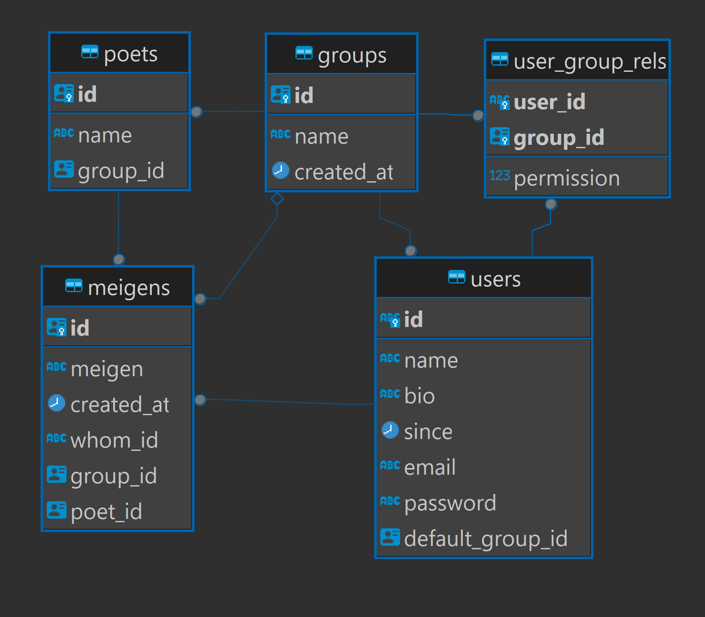

# meigens-api (名言API)

名言を管理するAPIです

This is the API you can manage 'meigens(名言)'

# API Documentation

Query parameters ending in `_id` means that a uuid is expected to be passed,
but no string value is expected.

## Authentication Middleware

### `POST` /signup

Query Parameters

* `username`
* `password`

### `POST` /login

Query Parameters

* `username`
* `password`

Response &rArr;
```json
{
	"message": "You got an access token.",
	"token": YOUR TOKEN,
}
```

## Application

**Authentication required.**

Specify your token `Authentication: [YOUR TOKEN]` in the request header.

### `POST` /auth/add_group

Query Parameters

* `group_name`

### `POST` /auth/fetch_group_ids

Response &rArr;
```json
{
    "groups": [GROUP_IDs],
}
```

### `POST` /auth/add_meigen_to_group

Query Parameters

* `group_id` (Can be obtained by calling `/auth/fetch_group_ids`)
* `poet`
* `meigen`


## ER Diagram
