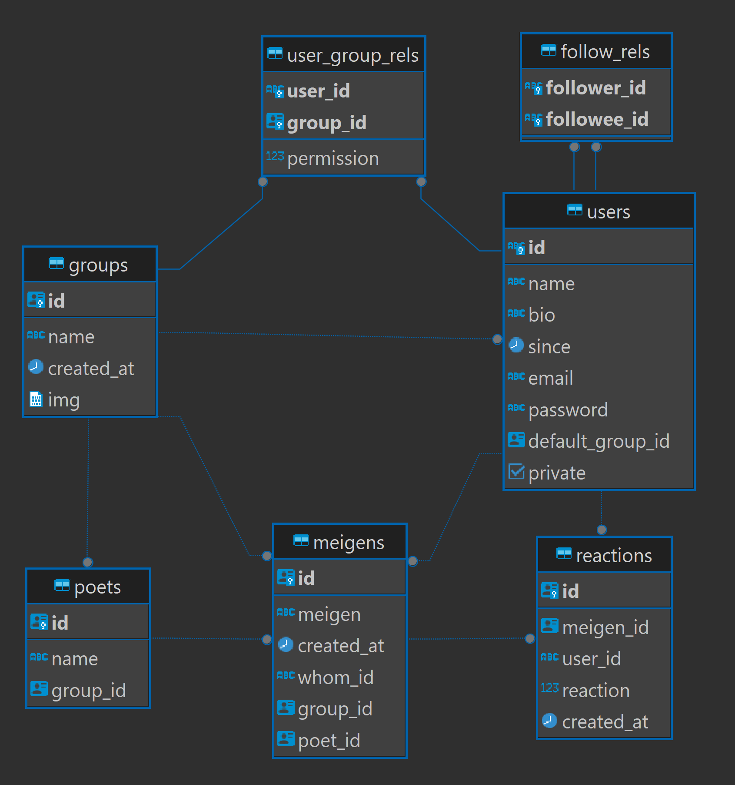

# meigens-api (名言API)

名言を管理するAPIです。

下にあるER図を見ながらこれを読めば分かると思われる。基本的に、
ユーザ(users)が存在し、ユーザはグループ(groups)に所属し、
グループが名言(meigens)を持っているという形。
名言は発言者(poets)を設定することができる。
なお、ユーザが単体で名言を持つことも出来るが、
それはデフォルトグループが名言を持つという形で表現される。
これでは抽象的で意味が分かりにくいと思うので、具体例で示そう。

users: 佐藤 が groups: I高専 に所属していて、
poets: K先生 の meigen: 「センサーは千差万別、ダジャレではない。」
という名言を追加したり編集したり色々する感じである。

基本的なデータの扱いは上の通りで、フォローの機能もある。

This is the API you can manage 'meigens(名言)'

## ER Diagram


# Dependency

* sqlc (to generate ORM code)

* Atlas (to migrate)

* Docker (postgres)

TODO: そのうち全部Dockerで管理するようにしたい.

# Migration

`~$ ./migrate.sh`

# API Documentation

## Authorization Middleware

### `POST` /signup

Post Parameters

* `username`
* `user_id`
* `email`
* `password`

### `POST` /login

Post Parameters

* `user_id`
* `password`

Response &rArr;
```json
{
	"message": "You got an access token.",
	"token": "YOUR TOKEN"
}
```

## Application

** Authorization required.**

Specify your token `Authorization: [YOUR TOKEN]` in the request header.

### `POST` /auth/search_users

Post Parameters

* `query`

Response &rArr;
```json
{
	"users": ["USER_ID", "USERNAME"]
}
```

***

### `GET` /auth/fetch_group_ids

Response &rArr;
```json
{
    "group_ids": ["GROUP_ID"]
}
```

***


### `POST` /auth/add_group

Post Parameters

* `group_name`

Response &rArr;
```json
{
	"message": "Successfully added the group.",
	"group_id": "GROUP_ID"
}
```

***

### `POST` /auth/add_meigen

Post Parameters

* `poet`
* `meigen`

Response &rArr;
```json
{
	"message": "Successfully added the meigen.",
	"meigen_id": "MEIGEN_ID"
}
```

***

### `POST` /auth/add_meigen_to_group

Post Parameters

* `group_id` (Can be obtained by calling `/auth/fetch_group_ids`)
* `poet`
* `meigen`

Response &rArr;
```json
{
	"message": "Successfully added the meigen.",
	"meigen_id": "MEIGEN_ID"
}
```

***

### `POST` /auth/follow

Post Parameters

* `target_id`

***

### `PATCH` /auth/patch_user_image

Post Parameters

* `image` (Image File (png, jpg))

Response &rArr;
```json
{
	"message": "Successfully patched the user image.",
}
```

***

### `PATCH` /auth/path_group_image

Post Parameters

* `group_id`
* `image` (Image File (png, jpg))

Response &rArr;
```json
{
	"message": "Successfully patched the group image.",
}
```

***

### `POST` /auth/reaction

Post Parameters

* `meigen_id`
* `reaction` (int32 (enum))

***
Response &rArr;
```json
{
	"message": "Successfully added the reaction.",
	"reaction_id": REACTION_ID,
}
```

### `GET` /auth/fetch_tl

Query Parameters

* `before` (unixtime)

Response &rArr;
```json
{
	"contents": [
		{"MEIGEN": MEIGEN, "WhomID" USER_ID: , "Name": POET_NAME, "CreatedAt": UNIX_TIME}
	]
}
```

### `GET` /auth/fetch_user_imgs

Query Parameters

* `user_ids` (comma-separated)

Response &rArr;
```json
{
	"contents": [
		{"UserID": USER_ID, "Img": IMG(BLOB)}
	]
}
```

### `GET` /socket => Upgrade to WebSocket
名言をポストした際、ログイン中のフォロワーに名言が送られます。
こんな感じでサーバがクライアントに何かを送信する系の操作を実現するためには双方向通信が必要であり、
名言をポストしたりフェッチしたりする際にはこのソケット(WebSocket)が使われることになります。
(自動更新する名言のTLみたいなのを実現するためにWebSocketを使っているわけです。)

When you post a meigen, it will be sent to your logged-in followers.
To perform this operation, bidirectional communication is required.
Therefore, this endpoint has been upgraded to WebSocket,
and you need to use this socket to communicate with the meigens-api when posting or fetching a meigen.

Query Parameters

* user_id

#### data format:
```csv
[0-2],JWT,JSON DATA
```

* 1st column: instruction

* 2nd column: JWT

* 3rd column: payload (JSON)


#### client to server:

```csv
[0-2],JWT,JSON DATA
```

- 0 => Send TL state.

payload will be

```json
{
	"state": [0-1]
	// 0 => Global TL (All meigens will be fetched).
	// 1 => Local TL (the meigens from the users you follow or from the groups you've participeted in will be fetched.)
}
```

#### client to server (or server to client):

- 1 => Post the meigen as your posts.

payload will be

```json
{
	"meigen": "a ramen is wind.",
	"poet": "sato",
}
```

- 2 => Post the meigen as specified group's post.

payload will be

```json
{
	"meigen": "a ramen is wind.",
	"poet": "sato",
	"group_id": "GROUP_ID"
}
```

***

